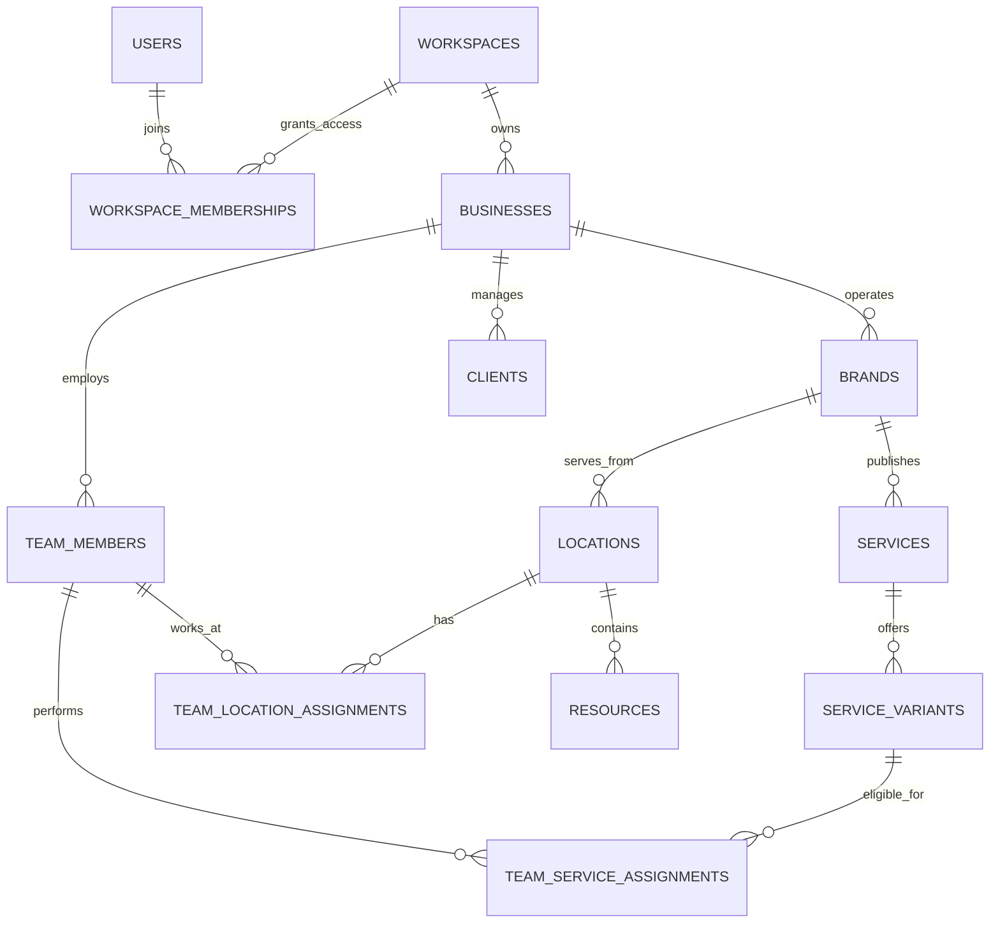
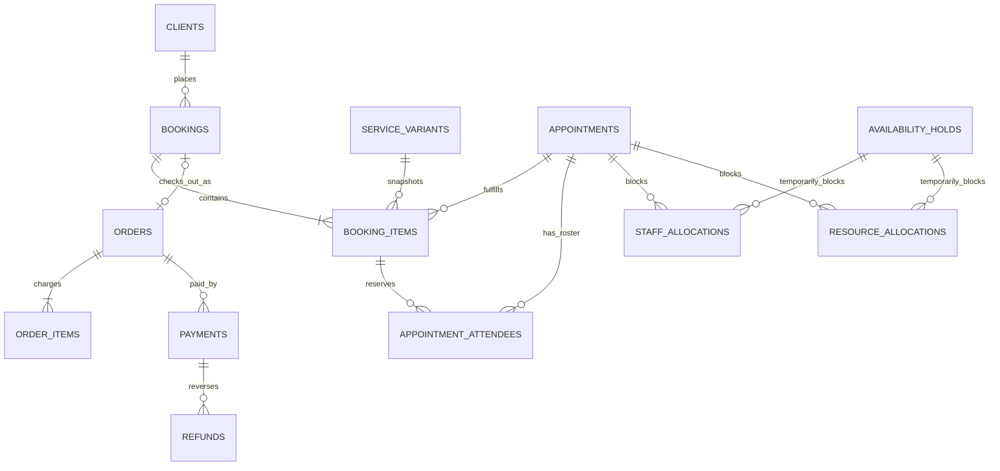
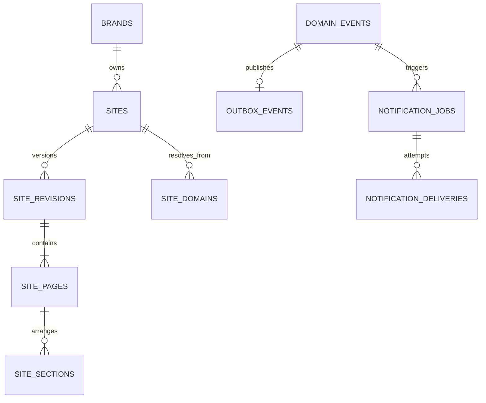

# Zhamo data model

- **Status:** recommended product and persistence model
- **Last updated:** 2026-08-25
- **Primary database:** PostgreSQL 18+
- **Architecture:** multi-tenant modular monolith, with transactional domain events and an outbox

This document defines the product logic and implementation-ready logical data model for Zhamo. It is intentionally broader than the current hardcoded UI, but it keeps a strict boundary between the scheduling core and optional growth modules.

The target customer is an appointment-led or class-led service business: beauty and wellness, healthcare administration, fitness, education, repair, automotive, and similar businesses. The scheduling core is shared across verticals; regulated clinical records, learning records, and other vertical-specific data are separate modules.

---

## 1. Executive recommendation

Zhamo should be modeled around the following hierarchy:

```text
Workspace (tenant and access boundary)
└── Business (legal/operating entity)
    ├── Brand (customer-facing identity and catalog)
    │   ├── Location(s)
    │   └── Site / booking experience
    ├── Team members and clients
    └── Orders, payments, and reporting
```

The most important semantic distinction is:

| Concept | Meaning | Example |
|---|---|---|
| `booking` | The customer's reservation and commercial commitment | Anahit books a haircut and beard trim, accepts a cancellation policy, and pays a deposit |
| `booking_item` | One selected service or seat inside a booking | Haircut with Karen; beard trim with Davit |
| `appointment` | A scheduled service occurrence on the operational calendar | Haircut, 14:00–14:45, at Kentron |
| `order` | What the business charged for | Two services, one retail product, a discount, tax, and a tip |
| `payment` | A real attempt or movement of money | AMD 5,000 card deposit and AMD 7,500 cash at checkout |

This separation supports multi-service visits, multiple staff, deposits, split tender, partial refunds, group classes, guest bookings, rescheduling, and trustworthy reporting.

### Decisions that remove ambiguous entities

- A **business owner is not a separate person table**. An owner is a `user` with an `owner` role in `workspace_memberships`. If that person also performs services, the membership is linked to a `team_member` profile.
- A **workspace** is the tenant/security boundary. A **business** is the legal or operating entity. A **brand** is what clients see. A **location** is where or how work is delivered.
- A **client is not required to have an app account**. The current login-free, SMS-verified booking flow creates or matches a business-scoped client record.
- **Available time slots are calculated, not stored.** Persist opening hours, staff/resource availability, temporary holds, calendar blocks, and confirmed allocations.
- **Financial facts are append-oriented.** Never rewrite a successful payment into a refund or overwrite an inventory/loyalty balance; record a compensating transaction.
- **Historical names, durations, prices, taxes, and policies are snapshots** on booking/order records. Catalog edits must not rewrite history.
- **Site publishing is versioned and atomic.** Draft edits never mutate the currently published revision.

---

## 2. Product logic chosen for the incomplete UI

### 2.1 Owner onboarding

1. Sign-up creates a `user`.
2. “Set up my workspace” transactionally creates:
   - one `workspace`;
   - one `workspace_membership` with the `owner` role;
   - one `business`;
   - one `brand` using the selected vertical;
   - one primary `location` with IANA timezone and currency;
   - default roles, booking policy, notification rules, and an unpublished site draft.
3. Forced setup adds the first `service`, owner/team member, service assignment, and working hours.
4. The day calendar becomes available once at least one active service, bookable team member or resource, and availability rule exist.

Onboarding progress is resumable; it is not inferred from arbitrary nullable domain fields.

### 2.2 Public booking

1. The client chooses one or more services.
2. Zhamo filters eligible locations, team members, resources, policy constraints, and capacity.
3. “Any specialist” is a provider preference, not a fake team member.
4. Selecting a time creates a short-lived `availability_hold` and held staff/resource allocations.
5. The client enters a name and phone number and completes an expiring SMS challenge. No customer account is required.
6. Zhamo matches a client by normalized contact within the business, or creates one. Shared family phone numbers are supported and therefore phone is not an unconditional unique key.
7. If a deposit is required, the booking remains `pending_payment` until the provider confirms payment asynchronously.
8. Confirmation atomically creates or attaches appointments, activates calendar allocations, records policy/price snapshots, issues a management token, and queues confirmations.
9. If the hold lost a race, the API returns `409 Conflict` with real alternative slots, matching the prototype's recovery UI.

Public mutation endpoints require an idempotency key so retries cannot create duplicate bookings or charges.

### 2.3 Staff-created appointment

The appointment panel searches clients by normalized phone/name. Saving creates a `booking` even for a walk-in or phone booking, because it preserves a single commercial and notification model across all channels. A walk-in client may be a lightweight client with only a display name.

Staff can override price, duration, provider, notification behavior, and policy only when their permission set allows it. Every override stores a reason in the audit trail.

### 2.4 Visit and checkout

- `confirmed → checked_in → in_progress → completed` is the normal appointment path.
- `no_show` and `canceled` are terminal operational outcomes.
- Checkout opens or reuses the booking's order, adds service and product lines, applies discounts/taxes, accepts multiple payments, and optionally records tips.
- Appointment completion and payment are independent. A completed appointment can be unpaid; a prepaid appointment can later be canceled and refunded.
- Commissions are earned from immutable order items according to the rule snapshot, then reversed proportionally by refunds.

### 2.5 Group classes and multi-guest bookings

An `appointment(kind = 'group')` is created ahead of time with a capacity and roster. Many booking items may reserve seats on the same appointment. One customer may book several guests; each guest becomes an `appointment_attendee`. Capacity is enforced under a row lock when a hold or booking is confirmed.

For a private multi-service visit, one booking has multiple booking items and normally multiple sequential appointments. This permits different staff or resources per service while preserving one checkout.

### 2.6 Site and booking builder

The branding and landing-builder prototypes become one versioned `site` domain:

- Marketing content and layout live in site revisions.
- Services, prices, team profiles, locations, hours, reviews, and availability remain live domain data referenced by section filters; they are not copied into page JSON.
- Edits autosave into the sole draft revision.
- Publish validates the draft, freezes it, atomically changes `sites.published_revision_id`, and clones a new draft for future edits.
- Template changes affect presentation only. They cannot mutate service, booking, or payment data.

### 2.7 UI-to-domain map

| Current UI | Primary source of truth |
|---|---|
| `/onboarding`, `/setup` | workspace, business, brand, location, team, catalog, availability |
| `/booking` staff day calendar | appointments plus staff/resource allocations |
| `/appointment-panel` | booking, booking items, appointments, client, order |
| `/customer` | site/widget settings, availability query, holds, guest verification, booking |
| `/team` | team member, identity link, roles, location/service assignments, working hours |
| `/clients` | clients and contacts plus derived client metrics |
| `/services` | service catalog, variants, staff/location/resource eligibility |
| `/resources` | location resources and resource allocations |
| `/products` | product variants and inventory movements |
| `/finance` | orders, payments, refunds, payouts; never a manually edited transaction feed |
| `/payroll` | contracts, commission earnings, time entries, payroll runs |
| `/loyalty` | program, account, tier, and append-only points ledger |
| `/notifications` | notification rules/templates/jobs/deliveries and in-app inbox |
| `/branding`, `/landing-builder` | sites, revisions, pages, sections, domains, media |
| `/billing` | Zhamo platform subscription, isolated from merchant/customer payments |
| `/reports` | read models derived from operational and financial facts |

---

## 3. Research-informed capability baseline

The goal is not to copy a competitor schema. Current products validate which concepts must remain independent:

- Fresha exposes team/resource calendars, appointments, forms, waitlists, group appointments, client wallets, custom staff pricing/duration, commissions, inventory, and pay runs in one platform. This supports dedicated resources, staff-service overrides, CRM history, and financial modules rather than text fields on an appointment. See [Fresha features](https://www.fresha.com/for-business/features).
- Square supports processing time, multi-staff appointments, deposits, cancellation/no-show policies, classes/packages, multi-location operations, waitlists, and resource management. This supports step-level occupancy, policy snapshots, and booking/payment separation. See [Square Appointments plans and features](https://squareup.com/us/en/appointments/pricing).
- Mindbody combines private appointments and capacity-limited classes with booking windows, eligibility, automated waitlists, late cancellation, and no-show rules. This supports one appointment model with private/group modes plus separate attendees. See [Mindbody scheduling](https://www.mindbodyonline.com/en-gb/business/scheduling).
- GlossGenius emphasizes login-free booking, a branded booking website, centralized client history/preferences, automated reminders, forms, deposits, and client self-service. This supports business-scoped guest clients, secure management tokens, versioned sites, and event-driven notifications. See [GlossGenius client management](https://glossgenius.com/client-management).

The current UI already implies most of this baseline: multi-vertical onboarding, multi-service carts, provider choice, resources, waitlists, deposits, client search, notifications, product sales, loyalty, payroll, and explicit site publishing.

---

## 4. Modeling and storage conventions

### 4.1 Naming and common fields

- PostgreSQL tables and columns use `snake_case` and plural table names.
- Primary keys are application-generated UUIDv7 values stored as `uuid`.
- Every tenant-owned table includes `workspace_id`, even when it is derivable through a parent. Composite foreign keys must prove that parent and child share a workspace.
- Mutable aggregate roots include `created_at`, `updated_at`, and integer `version` for optimistic concurrency.
- `created_by_membership_id` and `updated_by_membership_id` are included where manual authorship matters.
- Catalog/profile rows use `archived_at`; financial, booking-history, audit, and ledger rows are not soft-deleted.
- Human references such as `booking_number` and `order_number` are separate from primary keys and unique within their business.
- Prefer lowercase text status codes with `CHECK` constraints or reference tables over PostgreSQL native enums, because product workflows will evolve.

### 4.2 Money

- Store money as `bigint` integer minor units plus a three-letter ISO 4217 `currency_code`; never use floating point.
- Every order and payment is single-currency.
- Store catalog price and the immutable charged price separately.
- A zero-decimal currency still uses its ISO minor-unit convention; formatting belongs in the application.
- Derived totals are recomputed and checked in the transaction that changes an order.

### 4.3 Time

- Store real instants as `timestamptz` in UTC.
- Store `locations.timezone` as an IANA name such as `Asia/Yerevan`, never as `GMT+4`.
- Recurring hours use local `time`, ISO weekday `1..7`, an IANA timezone, and optional effective dates.
- Time ranges are half-open: `[start_at, end_at)`. Thus an appointment ending at 15:00 does not conflict with one starting at 15:00.
- Store an appointment's timezone snapshot so historical rendering does not change if a location changes timezone.
- Durations are integer minutes; UI strings such as “1 h 15 min” are presentation.

### 4.4 Structured data versus JSON

Use columns and foreign keys for ownership, money, scheduling, status, reporting, and permissions. Use versioned `jsonb` only for:

- site section presentation props;
- frozen policy/provider request snapshots;
- provider webhook payloads;
- non-queryable audit diffs;
- vertical-specific form answers with a schema version.

Do not put services, staff IDs, appointment items, prices, or access rules into unvalidated JSON blobs.

### 4.5 Source of truth versus projections

Client lifetime spend, client balance, visit counts, appointment occupancy, product stock, loyalty points, revenue charts, and payroll totals are derived read models. They may be cached in projection tables or materialized views, but their source facts remain orders, payments/refunds, completed attendance, inventory movements, loyalty ledger entries, and commission earnings.

---

## 5. High-level relationship model

### 5.1 Tenant, catalog, and people



### 5.2 Booking, calendar, and commerce



### 5.3 Publishing and events



---

## 6. Core table catalog

Notation: `→ table` is a foreign key, `?` means nullable, and “snapshot” means immutable after confirmation/issuance.

### 6.1 Identity, tenancy, and authorization

#### `users`

Global authentication identity, never a client CRM record.

- `id uuid PK`
- `primary_email text?`, `primary_phone_e164 text?`
- `display_name text`, `avatar_asset_id uuid?`
- `auth_subject text UNIQUE` — ID from the authentication provider
- `status text` — `active | suspended | deleted`
- `last_login_at timestamptz?`, timestamps

#### `workspaces`

Tenant and billing boundary.

- `id uuid PK`, `name text`, `slug text UNIQUE`
- `status text` — `trial | active | past_due | suspended | closed`
- `default_locale text`, `data_region text?`
- timestamps

#### `workspace_memberships`

User access to a workspace. This is where ownership lives.

- `id uuid PK`, `workspace_id → workspaces`, `user_id → users`
- `status text` — `invited | active | suspended | revoked`
- `joined_at timestamptz?`, `last_active_at timestamptz?`
- `UNIQUE (workspace_id, user_id)`

#### `roles`, `permissions`, `role_permissions`, `membership_roles`

Workspace-scoped RBAC. Seed roles are `owner`, `manager`, `receptionist`, `professional`, `marketer`, and `accountant`; custom roles may be added later.

- `roles`: `id`, `workspace_id`, `code`, `name`, `is_system`, unique `(workspace_id, code)`
- `permissions`: stable global `code` such as `appointments.write` or `finance.refund`
- `role_permissions`: `(role_id, permission_id)`
- `membership_roles`: `(membership_id, role_id)`

At least one active owner must remain. The last owner cannot remove or demote themself.

#### `membership_scopes`

Optional restrictions for multi-business/location teams.

- `membership_id → workspace_memberships`
- `business_id?`, `brand_id?`, `location_id?`
- exactly one scope target per row

No rows means workspace-wide access as allowed by the role.

#### `team_invitations`

- `id`, `workspace_id`, `team_member_id?`, `email_or_phone`, `token_hash`
- `invited_by_membership_id`, `expires_at`, `accepted_at?`, `revoked_at?`
- only hashes of invite tokens are stored

### 6.2 Business structure and settings

#### `businesses`

Legal/operating entity and owner of client and financial data.

- `id`, `workspace_id`
- `legal_name`, `trading_name?`, `registration_number?`, `tax_number?`
- `country_code`, `base_currency_code`, `default_timezone`
- `status` — `draft | active | suspended | closed`
- `billing_email?`, `support_email?`, timestamps

#### `brands`

Customer-facing identity. One business may operate several brands.

- `id`, `workspace_id`, `business_id → businesses`
- `name`, `slug`, `vertical_code`
- `description?`, `public_phone?`, `public_email?`
- `logo_asset_id?`, `accent_token?`, `default_locale`
- `status` — `draft | active | archived`
- `UNIQUE (business_id, slug)`

`vertical_code` chooses defaults and terminology, not separate schemas. Use stable codes such as `beauty`, `healthcare_admin`, `fitness`, `education`, `consumer_services`, `automotive`, `retail`, and `other`.

#### `locations`

Physical, mobile, or virtual fulfillment location.

- `id`, `workspace_id`, `business_id`, `brand_id`
- `name`, `slug`, `kind` — `physical | mobile | virtual`
- structured address fields, `latitude?`, `longitude?`
- `timezone`, `currency_code`, `phone?`, `email?`
- `is_primary boolean`, `online_booking_enabled boolean`
- `status` — `draft | active | temporarily_closed | archived`
- unique `(brand_id, slug)` and at most one primary location per brand

#### `location_hours`

Reusable weekly opening intervals; multiple rows allow split shifts.

- `id`, `workspace_id`, `location_id`
- `weekday smallint CHECK 1..7`
- `opens_at_local time`, `closes_at_local time`
- `valid_from date?`, `valid_until date?`
- `CHECK (opens_at_local < closes_at_local)`; overnight intervals are split across days

#### `location_hours_exceptions`

Holiday, closure, or special opening interval.

- `id`, `workspace_id`, `location_id`, `local_date`
- `kind` — `closed | open_override`
- `opens_at_local?`, `closes_at_local?`, `reason?`
- closed rows have no interval; override rows require a valid interval

#### `booking_policies`

Versioned policy defaults at brand/location level. Service variants may override selected fields.

- `id`, `workspace_id`, `brand_id`, `location_id?`, `version`
- `confirmation_mode` — `automatic | manual`
- `min_notice_minutes`, `max_advance_days`, `slot_interval_minutes`
- `cancellation_cutoff_minutes`, `reschedule_cutoff_minutes`
- `late_cancel_fee_type/value?`, `no_show_fee_type/value?`
- `deposit_type` — `none | fixed | percentage`, `deposit_value?`
- `waitlist_enabled`, `max_daily_online_bookings?`
- `guest_verification_required`, `active_from`, `retired_at?`

Confirmed bookings copy the effective rules into `bookings.policy_snapshot`; changing policy never changes an existing agreement.

#### `onboarding_progress`

- `workspace_id PK/FK`, `current_step`, `completed_steps jsonb`
- `completed_at?`, `dismissed_at?`, timestamps

This is workflow state only; domain validity is still enforced independently.

### 6.3 Team, services, availability, and resources

#### `team_members`

Employment/provider profile. A pending invite and a no-login contractor are valid.

- `id`, `workspace_id`, `business_id`, `user_id?`, `membership_id?`
- `first_name`, `last_name`, `display_name`, `phone_e164?`, `email?`
- `position_title`, `bio?`, `photo_asset_id?`, `calendar_color?`
- `employment_type` — `employee | contractor | owner | other`
- `employment_status` — `invited | active | leave | inactive | terminated`
- `online_bookable`, `public_profile_visible`
- `hire_date?`, `termination_date?`, timestamps

The user/membership link controls access; the team row controls operational scheduling. Either can exist without the other.

#### `team_location_assignments`

- `id`, `workspace_id`, `team_member_id`, `location_id`
- `starts_on?`, `ends_on?`, `is_primary`, `online_bookable`
- no overlapping active duplicate assignment for the same member/location

#### `service_categories`

- `id`, `workspace_id`, `brand_id`, `parent_id?`
- `name`, `description?`, `position`, `status`
- unique active name within the same parent and brand

#### `services`

Stable catalog concept shown to clients.

- `id`, `workspace_id`, `brand_id`, `category_id?`
- `name`, `slug`, `description?`, `image_asset_id?`
- `delivery_mode` — `private | group | either`
- `pricing_display` — `fixed | from | varies | hidden`
- `online_bookable`, `requires_staff`, `status`
- unique active `(brand_id, slug)`

#### `service_variants`

Bookable SKU of a service. Even a service with one duration has one variant.

- `id`, `workspace_id`, `service_id`
- `name?`, `sku?`, `duration_minutes`
- `buffer_before_minutes`, `buffer_after_minutes`
- `capacity default 1`, `online_capacity?`
- `price_minor`, `currency_code`, `tax_category_id?`
- optional policy overrides for deposit, cancellation, booking window
- `position`, `status`, timestamps

Examples are “Haircut / 45 minutes”, “Consultation / new client”, or “Reformer / 10-class eligible”.

#### `service_steps`

Optional premium scheduling detail for services with unattended processing time or multiple stages.

- `id`, `workspace_id`, `service_variant_id`, `position`, `name`
- `duration_minutes`
- `staff_occupancy` — `required | optional | none`
- `resource_occupancy` — `required | none`

If no rows exist, the whole variant duration consumes its assigned staff/resources.

#### `service_location_settings`

- `id`, `workspace_id`, `service_variant_id`, `location_id`
- `enabled`, `online_bookable`
- `price_minor_override?`, `currency_code?`, `duration_minutes_override?`
- unique `(service_variant_id, location_id)`

#### `team_service_assignments`

- `id`, `workspace_id`, `team_member_id`, `service_variant_id`
- `enabled`, `online_bookable`, `skill_level?`
- `price_minor_override?`, `duration_minutes_override?`
- `commission_rule_id?`
- unique `(team_member_id, service_variant_id)`

This replaces mock strings such as `"Karen, Davit"` and supports individual pricing/duration.

#### `team_working_hours`

Recurring provider availability, not necessarily identical to location hours.

- `id`, `workspace_id`, `team_member_id`, `location_id`
- `weekday`, `starts_at_local`, `ends_at_local`
- `valid_from?`, `valid_until?`

#### `team_availability_exceptions`

- `id`, `workspace_id`, `team_member_id`, `location_id?`, `local_date`
- `kind` — `unavailable | available_override`
- `starts_at_local?`, `ends_at_local?`, `reason?`

#### `resources`

Rooms, chairs, stations, vehicles, and equipment that can be scheduled.

- `id`, `workspace_id`, `location_id`, `parent_resource_id?`
- `name`, `resource_type`, `capacity default 1`
- `status` — `active | maintenance | inactive | archived`
- `notes?`

If units need independent maintenance or reporting, represent them as separate resource rows rather than one capacity count.

#### `service_resource_requirements`

- `id`, `workspace_id`, `service_variant_id`
- `resource_type`, `quantity default 1`
- `specific_resource_id?`, `step_id?`
- `selection_mode` — `automatic | client_selects | staff_selects`

### 6.4 Client CRM and consent

#### `clients`

Business-scoped customer profile. It is not a global consumer identity.

- `id`, `workspace_id`, `business_id`, `user_id?`
- `first_name?`, `last_name?`, `display_name`
- `date_of_birth?`, `preferred_locale?`, `pronouns?`
- `status` — `active | blocked_online | archived | merged`
- `importance` — `regular | vip` initially; configurable tags should handle most segmentation
- `source_code?`, `referral_client_id?`, `merged_into_client_id?`
- `online_booking_disabled`, `archived_at?`, timestamps

Do not store lifetime spend, balance, visit count, first visit, or last visit here; those are projections.

#### `client_contacts`

- `id`, `workspace_id`, `business_id`, `client_id`
- `type` — `phone | email`
- `value_display`, `value_normalized`, `is_primary`, `verified_at?`
- `can_receive_transactional`, `can_receive_marketing`, `marketing_consent_at?`
- indexes on `(business_id projection or workspace_id, type, value_normalized)` for matching

Duplicate contact values are allowed to support families and shared front desks. The match flow may ask staff/client to disambiguate.

#### `client_addresses`

- `id`, `workspace_id`, `client_id`, `label`, structured address fields
- `is_primary`, timestamps

#### `client_notes`

- `id`, `workspace_id`, `client_id`, `author_team_member_id?`
- `body`, `visibility` — `all_staff | managers | author_only`
- `pinned_at?`, timestamps

General client notes must not hold regulated clinical records. A healthcare deployment needs a separate access-controlled clinical module and compliance review.

#### `tags`, `client_tags`

- `tags`: `id`, `workspace_id`, `business_id`, `name`, `color?`
- `client_tags`: `(client_id, tag_id, assigned_at, assigned_by_membership_id)`

Segments such as new, returning, lost, or expiring membership are saved queries/read models, not hardcoded tags.

#### `client_consents`

Append-only evidence for marketing, privacy, waiver, and terms decisions.

- `id`, `workspace_id`, `client_id`
- `purpose`, `status` — `granted | denied | withdrawn`
- `policy_version`, `captured_via`, `captured_at`
- `ip_address_hash?`, `evidence_json?`

#### `form_templates`, `form_template_versions`, `form_submissions`

Optional intake/form module:

- templates belong to a business/brand and have immutable versions;
- a service can require a template version;
- submissions link to client, booking, and optionally appointment;
- answers use schema-versioned encrypted JSON only after access/retention requirements are defined.

#### `client_metrics`

Rebuildable projection keyed by client:

- `completed_visit_count`, `no_show_count`
- `first_completed_at?`, `last_completed_at?`, `next_appointment_at?`
- `gross_sales_minor`, `net_sales_minor`, `outstanding_minor`
- `average_ticket_minor`, `updated_at`

### 6.5 Bookings, appointments, holds, and waitlists

#### `bookings`

Customer-facing reservation aggregate.

- `id`, `workspace_id`, `business_id`, `brand_id`, `location_id?`
- `booking_number`, `client_id?`
- `channel` — `staff | public_site | widget | marketplace | import | api | walk_in`
- `status` — `draft | held | pending_payment | pending_confirmation | confirmed | partially_completed | completed | canceled | expired`
- `provider_preference` — `any | specific | no_preference`
- `preferred_team_member_id?`
- `party_size default 1`, `customer_note?`, `internal_note?`
- `currency_code`, `subtotal_minor`, `discount_minor`, `tax_minor`, `total_minor`, `deposit_required_minor`
- `policy_snapshot jsonb`, `pricing_version?`
- `hold_expires_at?`, `confirmed_at?`, `completed_at?`
- `canceled_at?`, `cancellation_reason_code?`, `canceled_by_type?`
- `created_by_membership_id?`, timestamps, optimistic `version`
- unique `(business_id, booking_number)`

Totals are aggregate snapshots checked against active booking items. Payment balance is derived from the order/payments, not stored as booking status.

#### `booking_items`

- `id`, `workspace_id`, `booking_id`, `service_variant_id`
- `appointment_id?` — null while the booking is only a draft/hold
- `quantity default 1`, `status`
- `service_name_snapshot`, `variant_name_snapshot?`
- `duration_minutes_snapshot`, `unit_price_minor`, `currency_code`
- `discount_minor`, `tax_minor`, `line_total_minor`
- `requested_team_member_id?`, `notes?`, `position`

`appointment.service_variant_id` and `booking_item.service_variant_id` must match when linked.

#### `appointments`

Scheduled operational occurrence. A group appointment can serve many booking items.

- `id`, `workspace_id`, `business_id`, `brand_id`, `location_id`
- `service_variant_id?` — null only for pure calendar blocks represented during migration
- `series_id?`, `kind` — `private | group`
- `title_snapshot`, `starts_at`, `ends_at`, `timezone_snapshot`
- `capacity default 1`, `online_capacity?`
- `status` — `tentative | confirmed | checked_in | in_progress | completed | canceled | no_show`
- `customer_visible_note?`, `internal_note?`
- `confirmed_at?`, `checked_in_at?`, `started_at?`, `completed_at?`
- `canceled_at?`, `cancellation_reason_code?`
- timestamps, optimistic `version`

Private appointment capacity is one. Group capacity is enforced through active attendee rows.

#### `appointment_segments`

Immutable scheduling snapshot of a service's steps after confirmation.

- `id`, `workspace_id`, `appointment_id`, `position`, `name`
- `starts_at`, `ends_at`
- `kind` — `active | processing | buffer`
- `requires_staff`, `requires_resource`

#### `appointment_attendees`

Roster and attendance, including guests without full client profiles.

- `id`, `workspace_id`, `appointment_id`, `booking_item_id`
- `client_id?`, `guest_name?`
- `status` — `reserved | confirmed | checked_in | completed | late_canceled | no_show | canceled`
- `checked_in_at?`, `notes?`
- one row per person/seat

#### `availability_holds`

Short-lived reservation header used during public/staff booking.

- `id`, `workspace_id`, `booking_id?`, `token_hash`
- `status` — `active | converted | expired | released`
- `expires_at`, `converted_at?`, timestamps
- index on active `expires_at`

An expiry worker marks stale holds and releases allocations. Confirmation checks `expires_at` inside the same transaction; it never trusts the worker alone. Before inserting a new hold, the command also releases any conflicting allocations whose hold has already expired, so a delayed worker cannot keep a slot blocked.

#### `staff_allocations`

Authoritative busy ranges for providers.

- `id`, `workspace_id`, `team_member_id`
- exactly one of `appointment_id`, `availability_hold_id`, `calendar_block_id`
- `starts_at`, `ends_at`, generated `slot tstzrange`
- `status` — `held | active | released | canceled`
- `segment_id?`

Active/held allocations for the same team member must not overlap. PostgreSQL range exclusion constraints are purpose-built for this scheduling rule; see [PostgreSQL range types](https://www.postgresql.org/docs/current/rangetypes.html).

#### `resource_allocations`

Same shape as staff allocations, with `resource_id` instead of `team_member_id`. Capacity-one resources use an exclusion constraint. Capacity greater than one is enforced by locking the resource row and counting active units, or preferably by representing individually schedulable units as separate resources.

#### `calendar_blocks`

Non-service busy time such as breaks, meetings, maintenance, or external calendar events.

- `id`, `workspace_id`, `location_id?`
- `kind` — `break | time_off | external | maintenance | other`
- `title`, `starts_at`, `ends_at`, `source`, `external_ref?`
- `created_by_membership_id?`, timestamps

The block affects availability only through staff/resource allocation rows.

#### `recurring_series`

- `id`, `workspace_id`, `timezone`, `rrule text`
- `starts_at_local`, `ends_on?`, `status`
- `service_variant_id?`, `location_id?`, timestamps

Materialize appointment occurrences only for a rolling horizon. Editing “this”, “this and following”, or “all” records explicit series exceptions rather than silently rewriting completed history.

#### `waitlist_entries`

- `id`, `workspace_id`, `business_id`, `brand_id`, `client_id`
- `service_variant_id`, `location_id?`, `preferred_team_member_id?`
- `earliest_at`, `latest_at`, `time_preferences jsonb?`, `party_size`
- `priority`, `status` — `waiting | offered | booked | expired | withdrawn`
- `offered_hold_id?`, `offer_expires_at?`, timestamps

An offer creates a real availability hold. “First in line”, “highest priority”, or “offer to all” is a configurable matching policy, never a manual status edit.

#### `booking_access_tokens`

Allows no-account customer self-service.

- `id`, `workspace_id`, `booking_id`, `token_hash`
- `purpose` — `view | manage | cancel | reschedule`
- `expires_at`, `used_at?`, `revoked_at?`

Store only a strong token hash. Rate-limit and rotate tokens after sensitive changes.

### 6.6 Orders, payments, refunds, and financial facts

#### `orders`

Merchant sale/receivable, either linked to a booking or created as retail-only.

- `id`, `workspace_id`, `business_id`, `location_id`, `booking_id?`, `client_id?`
- `order_number`, `status` — `draft | open | partially_paid | paid | void | partially_refunded | refunded`
- `currency_code`
- `subtotal_minor`, `discount_minor`, `tax_minor`, `tip_minor`, `total_minor`
- `opened_at`, `closed_at?`, `voided_at?`, `void_reason?`
- `created_by_membership_id?`, timestamps, `version`
- unique `(business_id, order_number)`

`amount_paid` and `amount_due` are derived from successful payments minus successful refunds. Normally one non-void order belongs to one booking.

#### `order_items`

- `id`, `workspace_id`, `order_id`
- `item_type` — `service | product | membership | package | gift_card | fee | custom`
- `booking_item_id?`, `product_variant_id?`, `source_entity_id?`
- `name_snapshot`, `description_snapshot?`, `quantity`
- `unit_price_minor`, `discount_minor`, `tax_minor`, `line_total_minor`
- `tax_snapshot jsonb?`, `commission_rule_snapshot jsonb?`
- `fulfilled_at?`, `voided_at?`, `position`

#### `order_adjustments`

Explicit order/item discount, tax, service charge, or rounding entry.

- `id`, `workspace_id`, `order_id`, `order_item_id?`
- `kind` — `discount | tax | service_charge | rounding`
- `name`, `amount_minor`, `source`, `promotion_id?`, `reason?`

#### `payments`

One tender/payment intent. Multiple payments may pay one order.

- `id`, `workspace_id`, `business_id`, `order_id`
- `amount_minor`, `currency_code`
- `method_type` — `card | cash | bank_transfer | wallet | gift_card | other`
- `provider` — `stripe | local_provider | manual | other`
- `provider_payment_id?`, `provider_customer_id?`
- `status` — `requires_method | requires_action | processing | authorized | succeeded | failed | canceled`
- `idempotency_key?`, `failure_code?`, `failure_message_safe?`
- `authorized_at?`, `captured_at?`, `failed_at?`, timestamps

Never store PAN, CVC, or raw wallet credentials. Store only provider tokens and safe display metadata.

#### `saved_payment_methods`

- `id`, `workspace_id`, `business_id`, `client_id`
- `provider`, `provider_customer_id`, `provider_method_id`
- `type`, `brand?`, `last4?`, `expiry_month?`, `expiry_year?`
- `consent_reference?`, `is_default`, `revoked_at?`

#### `refunds`

Independent, append-only reversal of a successful payment.

- `id`, `workspace_id`, `business_id`, `payment_id`, `order_id`
- `amount_minor`, `currency_code`
- `reason_code`, `note?`, `provider_refund_id?`
- `status` — `pending | succeeded | failed | canceled`
- `requested_by_membership_id?`, `requested_at`, `completed_at?`

Multiple partial refunds are allowed, but their successful/pending sum cannot exceed the captured payment. Stripe likewise models multiple partial refunds independently; see [Stripe refunds](https://docs.stripe.com/refunds).

#### `refund_items`

- `refund_id`, `order_item_id`, `quantity?`, `amount_minor`

This preserves item-level sales, tax, inventory, and commission reporting after partial refunds.

#### `tip_allocations`

- `id`, `workspace_id`, `order_id`, `team_member_id`
- `amount_minor`, `allocation_method`, `created_at`

#### `financial_events`

Optional append-only operational ledger for reporting and reconciliation.

- `id`, `workspace_id`, `business_id`, `order_id?`, `payment_id?`, `refund_id?`
- `event_type`, `amount_minor`, `currency_code`, `effective_at`
- `reverses_event_id?`, `metadata jsonb?`

This is not a full general ledger. Export accounting entries to a dedicated accounting integration when required.

### 6.7 Site builder, branding, domains, and media

#### `media_assets`

- `id`, `workspace_id`, `business_id?`
- `storage_key`, `mime_type`, `byte_size`, `width?`, `height?`
- `checksum`, `alt_text?`, `status` — `uploading | ready | failed | deleted`
- `created_by_membership_id?`, timestamps

Public URLs are derived/signed; the database stores stable storage keys.

#### `sites`

- `id`, `workspace_id`, `brand_id`
- `name`, `site_type` — `marketing | booking | combined`
- `default_locale`, `status` — `draft | published | suspended`
- `published_revision_id?`, `primary_domain_id?`
- timestamps, `version`

#### `site_revisions`

- `id`, `workspace_id`, `site_id`, `revision_number`
- `state` — `draft | published | archived`
- `base_revision_id?`, `template_code`, `schema_version`
- `theme_json`, `navigation_json`, `footer_json`
- `change_count`, `created_by_membership_id?`
- `published_at?`, `published_by_membership_id?`, timestamps
- exactly one draft revision per site; unique `(site_id, revision_number)`

A published revision is immutable. Rollback republishes a clone as a new revision; it never changes the old record.

#### `site_pages`

- `id`, `workspace_id`, `revision_id`
- `stable_key` — identity carried across revisions
- `slug`, `title`, `page_type`, `position`, `is_home`
- `seo_title?`, `seo_description?`, `social_image_asset_id?`
- unique `(revision_id, slug)` and one home page per revision

#### `site_sections`

- `id`, `workspace_id`, `page_id`, `stable_key`
- `section_type` — validated registry such as `hero`, `services`, `team`, `gallery`, `reviews`, `hours`, `faq`, `custom`
- `position`, `enabled`, `schema_version`, `props_json`

`props_json` contains presentation and filters, not copied service/team rows. Validate it against the section type and schema version before save and publish.

#### `site_domains`

- `id`, `workspace_id`, `site_id`
- `hostname`, `kind` — `platform_subdomain | custom`
- `status` — `pending | verifying | active | failed | detached`
- `verification_token_hash?`, `verified_at?`, `tls_status?`, `is_primary`
- globally unique normalized hostname

#### `booking_widget_settings`

- `id`, `workspace_id`, `brand_id`, `site_id?`, `location_id?`
- `flow_version`, `allow_multi_service`, `allow_any_provider`
- `show_prices`, `show_remaining_capacity`, `require_sms_verification`
- `default_location_id?`, `theme_overrides_json?`, timestamps

The booking engine reads the same service/policy/availability domain regardless of whether it is rendered in a Zhamo site, embed, QR link, or partner channel.

### 6.8 Notifications, audit, integrations, and reliability

#### `notification_templates` and `notification_template_versions`

- template: `id`, `workspace_id`, `brand_id?`, stable `event_key`, `channel`, `locale`, `active_version_id?`
- version: immutable `subject?`, `body`, `schema_version`, `variables_schema`, authorship/timestamps
- channels: `sms | email | push | in_app`

#### `notification_rules`

- `id`, `workspace_id`, `brand_id?`, `location_id?`
- `event_key`, `channel`, `enabled`
- `offset_minutes` — e.g. `-1440` for 24 hours before
- `template_id`, `audience` — `client | assigned_team | role | explicit`
- `conditions_json?`, `quiet_hours_policy?`

#### `notification_jobs`

One durable intent to send one message on one channel.

- `id`, `workspace_id`, `event_id?`, `rule_id?`, `template_version_id`
- `recipient_type`, `recipient_id?`, `destination_snapshot`
- `channel`, `payload_snapshot`, `scheduled_for`
- `status` — `queued | sending | sent | failed | suppressed | canceled`
- `dedupe_key`, `attempt_count`, `last_error_safe?`, timestamps
- unique `(workspace_id, dedupe_key)`

#### `notification_deliveries`

Provider attempt history.

- `id`, `workspace_id`, `job_id`, `attempt_number`
- `provider`, `provider_message_id?`, `status`
- `attempted_at`, `delivered_at?`, `failed_at?`, `error_code?`
- unique `(job_id, attempt_number)`

#### `in_app_notifications`

- `id`, `workspace_id`, `membership_id`
- `type`, `title`, `body`, `action_url?`
- `read_at?`, `dismissed_at?`, `created_at`

#### `audit_logs`

Append-only security/business audit trail.

- `id`, `workspace_id`, `occurred_at`
- `actor_type` — `membership | client_token | system | integration`
- `actor_id?`, `action`, `entity_type`, `entity_id?`
- `before_json?`, `after_json?`, `reason?`
- `correlation_id`, `ip_hash?`, `user_agent_summary?`

Audit data is redacted and access-controlled. It is not an application debug log.

#### `domain_events` and `outbox_events`

- domain event: `id`, `workspace_id`, `aggregate_type`, `aggregate_id`, `aggregate_version`, `event_type`, `payload`, `occurred_at`
- outbox: `event_id UNIQUE`, `status`, `available_at`, `attempt_count`, `processed_at?`, `last_error_safe?`
- unique `(workspace_id, aggregate_type, aggregate_id, aggregate_version)`

Domain changes and their outbox record are committed in one transaction. Notification, analytics, search, and integration workers consume them asynchronously.

#### `webhook_events`

- `id`, `workspace_id?`, `provider`, `provider_account_id?`, `provider_event_id`
- `event_type`, `payload`, `signature_verified`, `received_at`, `processed_at?`, `status`
- unique `(provider, provider_account_id, provider_event_id)`

Providers may retry or deliver events out of order. Stripe explicitly recommends deduplicating event IDs and processing asynchronously; see [Stripe webhook best practices](https://docs.stripe.com/webhooks).

#### `idempotency_records`

- `id`, `workspace_id?`, `scope`, `idempotency_key`
- `request_hash`, `status`, `response_code?`, `resource_type?`, `resource_id?`
- `created_at`, `expires_at`
- unique `(workspace_id, scope, idempotency_key)`

The same key with a different request hash is rejected. This follows the safe-retry pattern documented by [Stripe idempotent requests](https://docs.stripe.com/api/idempotent_requests).

Application traces, metrics, and debug logs belong in an observability system. They should carry the same `correlation_id` but must not duplicate full client/payment payloads.

---

## 7. Optional growth modules

These modules integrate through IDs and domain events but should not complicate the booking transaction.

### 7.1 Inventory and retail

- `product_categories`
- `products` — stable product, brand, name, description, status
- `product_variants` — SKU/barcode, retail price, cost, tax category
- `inventory_locations` — usually maps to a business location, plus warehouse
- `inventory_movements` — append-only `receive | sale | return | adjustment | transfer_in | transfer_out | consume`; quantity is signed; links order/refund/purchase order
- `inventory_levels` — rebuildable projection, not source of truth
- `suppliers`, `purchase_orders`, `purchase_order_items`

`UNIQUE (business_id, sku)` for active product variants. A sale posts a negative movement; a refunded/returned item posts a positive movement.

### 7.2 Loyalty, packages, memberships, and gift cards

- `loyalty_programs`, `loyalty_tiers`
- `loyalty_accounts` — one per client/program
- `loyalty_transactions` — append-only points earn/redeem/expire/adjust/reversal
- `packages`, `package_entitlements`, `client_packages`, `package_redemptions`
- `membership_plans`, `client_memberships`, `membership_cycles`
- `gift_cards`, `gift_card_transactions`

Points, visits, credits, and gift-card balances are sums of their ledgers. Expiry is a transaction, not a mutation of the original earning row.

### 7.3 Payroll and commissions

- `employment_contracts` — effective-dated pay basis and currency
- `commission_rules` and `commission_tiers` — effective-dated, applicable to service/product/category/team/location
- `commission_earnings` — append-only earning/reversal linked to order item and provider
- `time_entries` — clock/shift facts with approval state
- `payroll_runs`, `payroll_run_items`, `payslips`, `payouts`

Payroll totals are frozen when a run is approved. Later corrections create adjustments in a later run. Zhamo should not claim statutory payroll compliance in a country until the country-specific module is implemented and reviewed.

### 7.4 Reviews and marketing

- `review_requests`, `reviews`, `review_responses`
- `campaigns`, `campaign_audiences`, `campaign_messages`
- `promotions`, `promotion_rules`, `promotion_redemptions`
- `referral_codes`, `referral_attributions`

Transactional and marketing consent are evaluated separately. An appointment confirmation must not imply consent to promotional messages.

### 7.5 Zhamo platform billing

Keep SaaS billing in a separate `platform_billing` schema:

- `plans`, `plan_prices`, `workspace_subscriptions`
- `subscription_items`, `platform_invoices`, `platform_payment_methods`
- `entitlements`, `usage_counters`

These records pay Zhamo. Merchant `orders/payments/refunds` represent money paid to the business. They must never share tables or statuses.

### 7.6 Regulated vertical modules

Healthcare, education, and similar verticals may add modules such as clinical encounters, treatment plans, prescriptions, learner records, or safeguarding notes. They require distinct permissions, encryption, audit, retention, consent, and jurisdiction review. The scheduling CRM in this document is not an EHR/EMR or student-record system.

---

## 8. Lifecycle state machines

### 8.1 Booking

```text
draft                -> held
held                 -> pending_payment | pending_confirmation | confirmed | expired
pending_payment      -> pending_confirmation | confirmed | expired
pending_confirmation -> confirmed | canceled | expired
confirmed            -> partially_completed | completed | canceled
partially_completed  -> completed | canceled
```

- `held` requires a non-expired active hold.
- `confirmed` requires at least one active booking item and confirmed appointment/seat allocation.
- Parent completion is derived from item/attendee outcomes and then persisted as a workflow transition.
- A partially canceled multi-item booking can remain confirmed/partially completed; item statuses carry detail.
- Never reuse `canceled` for no-show. No-show is an appointment/attendance outcome and can trigger a fee.

### 8.2 Appointment

```text
tentative -> confirmed -> checked_in -> in_progress -> completed
     |           |            |              |
     +-----------+------------+--------------+-> canceled
                 +-----------------------------> no_show
```

Allowed transitions are enforced in the domain service and recorded as domain/audit events. Direct arbitrary status updates are forbidden.

### 8.3 Order, payment, and refund

- Order: `draft → open → partially_paid → paid`; `open → void`; paid states may become `partially_refunded → refunded`.
- Payment: `requires_method → requires_action/processing/authorized → succeeded`, or `failed/canceled`.
- Refund: `pending → succeeded/failed/canceled`.

Booking confirmation must react to asynchronous payment success idempotently. Never trust the browser redirect alone.

### 8.4 Notification

`queued → sending → sent`, `queued/sending → failed`, or `queued → suppressed/canceled`. Provider delivery/read status is delivery metadata and must not rewrite the fact that Zhamo sent the message.

---

## 9. Critical invariants and concurrency rules

### 9.1 Tenant isolation

- Every tenant query is scoped by `workspace_id`.
- Child foreign keys use `(workspace_id, parent_id)` wherever practical, backed by `UNIQUE (workspace_id, id)` on the parent.
- PostgreSQL Row-Level Security is defense in depth, not a replacement for application authorization. With RLS enabled and no applicable policy, PostgreSQL uses default-deny behavior; see [PostgreSQL row security](https://www.postgresql.org/docs/current/ddl-rowsecurity.html).
- Background jobs carry an explicit workspace context; they never infer it from user input alone.

### 9.2 Preventing double-booking

For capacity-one staff/resources, use `btree_gist` and partial exclusion constraints conceptually equivalent to:

```sql
EXCLUDE USING gist (
  workspace_id WITH =,
  team_member_id WITH =,
  tstzrange(starts_at, ends_at, '[)') WITH &&
)
WHERE (status IN ('held', 'active'));
```

The booking transaction:

1. checks policy and current availability;
2. inserts active hold allocations or fails the exclusion constraint;
3. locks the hold and validates `expires_at` on confirmation;
4. creates booking/appointments and changes held allocations to active;
5. commits domain events/outbox with the aggregate;
6. returns alternatives after a conflict using a fresh availability calculation.

Never use “check availability, then insert later” across separate transactions.

### 9.3 Group capacity

Lock the group appointment row, count reserved/confirmed attendees plus active holds, ensure the requested seats do not exceed capacity, then create attendees. Add a monotonic `reserved_count` cache only if profiling requires it; the transaction still verifies capacity.

### 9.4 Money

- `line_total_minor = quantity × unit_price_minor - discount_minor + tax_minor` unless a documented rounding policy produces an explicit adjustment.
- Order currency equals every item, payment, and refund currency.
- Successful plus pending refunds may not exceed the captured payment amount.
- A refund never deletes or changes the original payment.
- Provider event IDs and idempotency keys are unique.

### 9.5 Historical integrity

- Confirmed booking/order snapshots are immutable except through explicit adjustment/cancellation flows.
- Catalog rows referenced by history are archived, not hard-deleted.
- Published site revisions, audit logs, consent evidence, inventory movements, loyalty transactions, commission earnings, and financial events are immutable.
- Optimistic `version` guards staff edits from silently overwriting a newer change.

### 9.6 Contact and token safety

- Normalize phones to E.164 where possible and emails to a documented canonical form while preserving display input.
- OTPs, invite tokens, booking management tokens, domain verification tokens, and API secrets are stored as hashes or in a secrets manager, never plaintext.
- OTP challenges are short-lived, attempt-limited, rate-limited by contact/IP/device signals, and deleted or irreversibly minimized after expiry.

---

## 10. Availability algorithm

Availability is a query/service, not a table of generated slots.

For each requested service combination:

1. Resolve eligible active service variants and effective location/team overrides.
2. Intersect location opening hours with team working hours for the location and date.
3. Apply location exceptions, team availability exceptions, booking-window rules, minimum notice, daily caps, and external calendar blocks.
4. Expand service steps, buffers, provider occupancy, and resource requirements.
5. Subtract active/held staff and resource allocations.
6. For group services, query scheduled group appointments with remaining online capacity.
7. Align candidate starts to the policy's slot interval in the location timezone.
8. Rank candidates by exact provider preference, continuity across multi-service bookings, earliest time, balanced workload, and then stable ID for deterministic results.

Return a signed/opaque availability quote containing the chosen variant/location/provider/resource plan, price/policy version, and short expiry. Revalidate everything when creating the hold.

---

## 11. Reporting definitions

Reports must name their accounting and operational basis. Suggested canonical measures:

| Metric | Definition |
|---|---|
| Completed appointments | Appointments transitioned to `completed` in the reporting interval |
| No-show rate | No-show attendee outcomes / (completed + no-show outcomes) |
| Occupancy | Active staff-allocation minutes for service appointments / available staff minutes; exclude breaks from denominator |
| Gross sales | Non-void order item totals before discounts/refunds |
| Net sales | Gross sales - discounts - successful item refunds, with tax reported separately |
| Cash collected | Successful payment amount by capture time - successful refunds by completion time |
| Outstanding | Open order totals - successful payments + successful refunds |
| Average ticket | Net sales / count of non-void closed orders |
| New client | First completed attendance occurs in the interval |
| Returning client | Has a completed attendance before the interval and another within it |
| Lost client | Configurable segment: no future booking and last completed attendance older than a business-defined threshold |
| Product stock | Sum of signed inventory movements per variant/location |
| Loyalty balance | Earn/adjust credits - redemption/expiry/reversal debits |

Store reporting dates in both UTC and the relevant location-local date dimension. Do not compare formatted strings or calculate financial reports from the mock finance feed.

Recommended projections/materialized views:

- `client_metrics`
- `daily_location_metrics`
- `daily_team_metrics`
- `daily_service_metrics`
- `inventory_levels`
- `loyalty_balances`
- `order_balances`

Each projection stores `updated_at` and the last processed domain-event position so it can be rebuilt and monitored for lag.

---

## 12. Privacy, security, and retention

- Keep authentication identities, staff employment profiles, and client CRM profiles separate.
- Encrypt sensitive data in transit and at rest; use field-level encryption for sensitive notes/form answers where the threat model requires it.
- Tokenize payment methods with a PCI-compliant provider; Zhamo stores only safe references/metadata.
- Apply least-privilege permissions. A provider may see their calendar and necessary client details without receiving finance exports, payroll, or all client notes.
- Record access to especially sensitive modules, not only mutations.
- Avoid raw PII in domain events, notification logs, analytics, error messages, and audit diffs. Store identifiers and purpose-limited snapshots.
- Client erasure should anonymize removable profile/contact data while preserving legally required, minimized financial and audit facts. Record the erasure action.
- Define retention schedules by data class and operating jurisdiction before launch. Avoid a universal `deleted_at` policy.
- Backups must preserve tenant isolation, encryption, restore testing, and documented recovery objectives.

---

## 13. Indexing and scale plan

Start normalized in one PostgreSQL database. Do not introduce microservices or table partitioning before measurements justify them.

Essential indexes include:

- every foreign key, with `workspace_id` first on tenant paths;
- `appointments (workspace_id, location_id, starts_at)` and status-aware calendar indexes;
- GiST exclusion/indexes for active staff/resource time ranges;
- `bookings (workspace_id, client_id, created_at desc)` and `(business_id, booking_number)`;
- `client_contacts (workspace_id, type, value_normalized)`;
- `orders (workspace_id, business_id, closed_at)` and `payments/refunds` provider IDs;
- active queue indexes on `outbox_events.available_at`, `notification_jobs.scheduled_for`, and `availability_holds.expires_at`;
- unique normalized hostname and brand/service/page slugs;
- GIN/full-text or a search service for client/service search only when basic normalized indexes become insufficient.

Likely high-volume append tables are audit logs, domain/outbox events, notification deliveries, webhook events, inventory movements, and financial events. Time partition those only after retention and query patterns are known. PostgreSQL warns that partitioning design should be chosen carefully rather than applied by default; see [PostgreSQL partitioning](https://www.postgresql.org/docs/current/ddl-partitioning.html).

---

## 14. Transaction and API boundaries

Use domain-oriented commands rather than generic CRUD for critical workflows:

- `CompleteOnboarding`
- `CreateAvailabilityHold`
- `ConfirmBooking`
- `RescheduleBookingItem`
- `CancelBooking`
- `CheckInAttendee`
- `CompleteAppointment`
- `OpenOrder`
- `AddOrderItem`
- `CapturePayment`
- `RequestRefund`
- `PublishSiteRevision`
- `MergeClients`

Every command:

1. establishes authenticated actor and workspace scope;
2. loads the aggregate at an expected version;
3. validates permissions, state transition, policy, and invariants;
4. persists changes, audit record, domain event, and outbox row in one transaction;
5. returns a stable resource representation;
6. is idempotent when external retries are possible.

Queries may use purpose-built read models. Do not expose raw table-shaped APIs that let clients set totals, tenant IDs, ownership, payment success, or arbitrary statuses.

---

## 15. Implementation phases

### Phase 1 — trustworthy scheduling foundation

- users, workspaces, memberships, seeded RBAC
- business, brand, location, hours, booking policy
- team members, locations, services/variants, assignments, working hours
- resources and requirements
- clients, contacts, notes/tags, basic consent
- bookings, items, private appointments, segments, allocations, holds
- staff-created and guest/SMS-verified public booking
- booking lifecycle, conflict recovery, cancellation/reschedule
- site, draft/published revisions, pages/sections, platform domain
- domain events, outbox, notifications, audit, idempotency, webhook inbox

### Phase 2 — checkout and operating depth

- orders/items/adjustments, card/cash payments, deposits, refunds, tips
- custom domains and media pipeline
- waitlist automation
- recurring/group appointments and attendees
- external calendar sync
- client forms and management tokens
- canonical reports/projections

### Phase 3 — growth suite

- products and inventory ledger
- loyalty, memberships, packages, and gift cards
- commissions, timesheets, payroll exports/runs
- reviews, promotions, campaigns
- multiple brands/businesses and fine-grained membership scopes
- accounting/marketplace integrations

Design Phase 1 foreign keys and events so later modules attach cleanly, but do not ship empty “enterprise” abstractions in the first migration.

---

## 16. Shortcuts to reject

- One `businesses` table containing owner, brand, location, and settings columns.
- A `business_owners` table duplicating user/team identity.
- One `appointments` row containing comma-separated services, staff, or resources.
- Treating booking and appointment as synonyms.
- A single `transactions` table for charges, payments, refunds, payouts, and payroll.
- Storing formatted money or dates such as `"7 500 ֏"` or `"02.07.2026"`.
- Storing `available_slots` rows months in advance.
- Calculating availability in the browser or relying only on a pre-insert check.
- Storing client balance, inventory stock, or loyalty balance without a fact ledger.
- Updating historical order price when a service price changes.
- Using a boolean `published` flag without immutable site revisions.
- Sending SMS/email inside the booking database transaction.
- Treating provider webhook delivery as exactly once or in order.
- Putting all section content, booking rules, permissions, or financial data into JSON.
- Hard-deleting canceled appointments or refunded payments.
- Mixing Zhamo's subscription billing with a business's customer payments.
- Using generic client notes as clinical records.

---

## 17. Final product boundary

The premium core is not the number of modules. It is the reliability of the shared foundation:

- clear tenant/business/brand/location ownership;
- precise booking, appointment, and payment semantics;
- conflict-safe availability;
- immutable financial and publishing history;
- login-free but secure client journeys;
- event-driven notifications and integrations;
- permissioned, auditable access;
- derived metrics with stable definitions.

With this model, the current UI can evolve from static demos into a coherent service-business operating system without redesigning the core whenever multi-location, group classes, deposits, payroll, or a new vertical is added.
